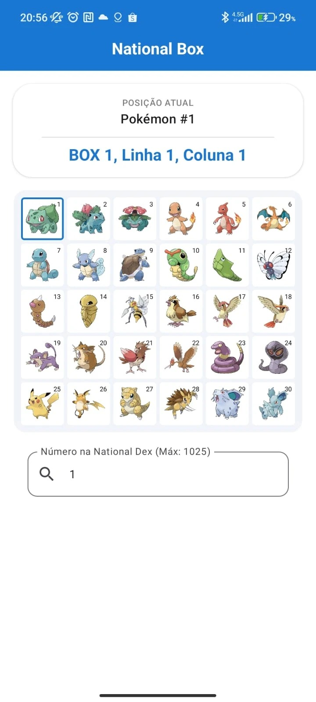
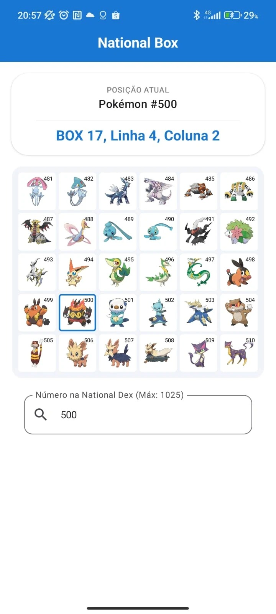
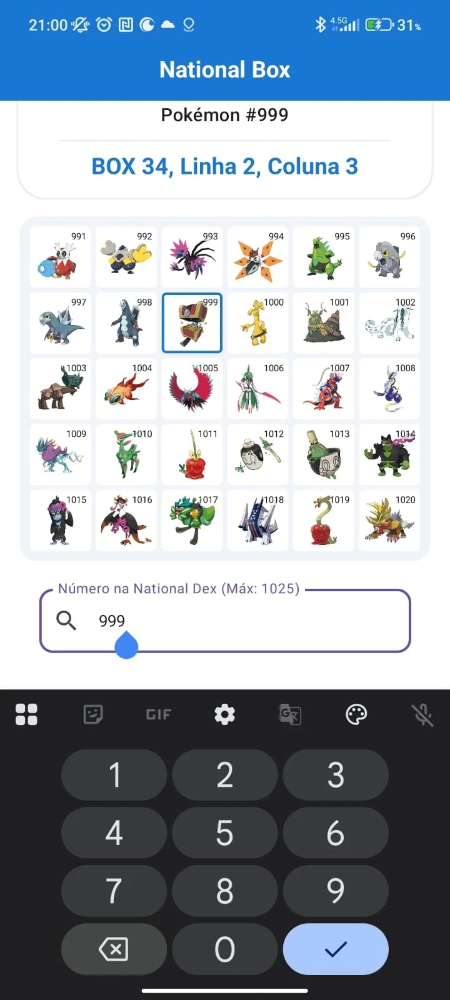

Sobre este app:
    O aplicativo National Box calcula em qual Box, Linha e Coluna um pokémon deve ser guardado baseado no seu ID na national Dex, funciona com todos os pokémon existentes até o momento, ignorando as formas alternativas e megas evoluções.

Link para instalação via PlayStore:
    https://play.google.com/store/apps/details?id=com.eltongustavo.nationalbox

Abaixo Screenshots do aplicativo em funcionamento

### Screenshot 1

### Screenshot 2

### Screenshot 3

